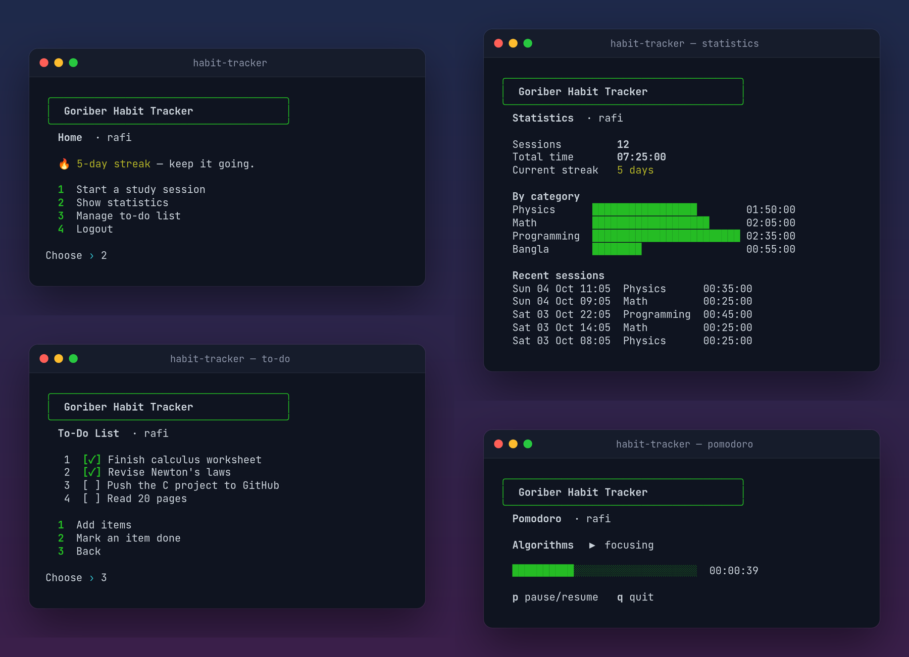

<div align="center">


# Goriber Habit Tracker

**A tiny, dependency-free study-habit tracker for the terminal.** Time your study sessions with a stopwatch, countdown or pomodoro, keep a to-do list, and watch your streak grow. Written in portable C11.

<sub><i>The logo: one must imagine Sisyphus happy (Camus). The boulder has accepted the streak.</i></sub>

[](https://github.com/happinessisreal/Goriber-Habit-Tracker/actions/workflows/ci.yml)
[](Makefile)
[](#-build--run)
[](LICENSE)



</div>

> *"Goriber"* (গরিবের) is Bangla for *"the poor man's"*. It's a humble habit tracker with no accounts, no cloud and no dependencies. One binary, one data file.

## ✨ Features

- **Three ways to study.**
  - **Stopwatch** counts up until you press Enter.
  - **Countdown** runs a fixed number of minutes.
  - **Pomodoro** shows a live progress bar. Single-key `p` pauses and `q` quits, and paused time doesn't count.
- **Every finished session is logged** with its subject, start time and duration.
- **Statistics** show total time, a **day streak** and **per-subject bar charts**, plus your recent sessions.
- **A to-do list** per user: add several items in one go and tick them off.
- **Multiple users** on one machine.
- **Everything is saved** to a small data file and is still there next time.
- **Input you can't break.** Junk input gets a friendly retry instead of an infinite loop, and closing stdin exits cleanly.
- Colour output on real terminals. It's plain text when piped or when [`NO_COLOR`](https://no-color.org) is set, and `FORCE_COLOR` turns colour on regardless.

## 🚀 Build & run

```bash
git clone https://github.com/happinessisreal/Goriber-Habit-Tracker.git
cd Goriber-Habit-Tracker
make          # builds ./habit-tracker (needs a C11 compiler; no libraries)
./habit-tracker
```

| Environment variable | Effect |
|---|---|
| `HABIT_DATA=path` | Where data is stored (default `./habit_data.dat`) |
| `NO_COLOR=1` / `FORCE_COLOR=1` | Turn colours off or on |

Runs on Linux and macOS. On Windows, use WSL, since the pomodoro uses POSIX terminal APIs.

## 🧱 Project layout

```
include/habit_tracker.h   data model (users, sessions, to-dos) and the public API
src/habit_tracker.c       screens, timers, statistics, streaks, persistence, safe input
src/main.c                menu loop
tests/smoke.sh            end-to-end tests that drive the real binary through stdin
tests/demo_data.c         generates the demo data used for the screenshots
```

## 🧪 Tests

```bash
make test
```

The smoke tests cover rejecting junk input, creating users, adding and completing to-dos, logging a session, the streak count, persistence across runs, and rejecting duplicate or unknown users. CI builds with `-Werror` using gcc and clang on Linux and macOS.

## 📄 License

[MIT](LICENSE)
